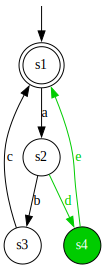

# gLTSdiff: Generalized LTS differencing

gLTSdiff is a library for comparing the structures of two or more Generalized Labeled Transition Systems (GLTSs), and merging them into a single combined GLTS.
gLTSdiff can be used and customized to compare and merge various types of directed graphs, labeled transition systems (LTSs), state machines, automata, and so on.

Out of the box, GLTs, LTSs, automata and difference automata can be compared.
Their comparison can be configured to use different comparison algorithms that allow for a trade-off between performance and the number of differences in the result.
The result may be post-processed to get rid of undesired patterns in the comparison result.
Furthermore, gLTSdiff is designed with extensibility in mind.
You may add your own representations, and customize the comparison, merging, output, and so on.

gLTSdiff is a generalization of the LTSdiff algorithm [proposed](https://doi.org/10.1145/2430545.2430549) by Neil Walkinshaw and Kirill Bogdanov, and implemented in the [StateChum library](https://github.com/kirilluk/statechum).
gLTSdiff is however more than only a generalization.
It also offers significant performance improvements over LTSdiff, and adds additional features like post-processing to improve comparison result.
gLTSdiff was first introduced, and formally defined, in the following article: Dennis Hendriks and Wytse Oortwijn, "gLTSdiff: A Generalized Framework for Structural Comparison of Software Behavior", 26th International Conference on Model Driven Engineering Languages and Systems (MODELS), 2023, to appear.

## Examples

To get a feel of what is possible with gLTSdiff, here are a few simple examples.

### Comparison of difference automata

Two difference automata (in red and green) may be compared and combined.
Their common parts are shown in black, while their differences remain in red and green:

<table>
  <tr align="center">
    <td></td>
    <td width="25px"/>
    <td></td>
    <td width="25px"/>
    <td></td>
  </tr>
  <tr align="center">
    <td>Input 1</td>
    <td width="25px"/>
    <td>Input 2</td>
    <td width="25px"/>
    <td>Result</td>
  </tr>
</table>

### Merging version-annotated automata

Any number of version-annotated automata could be combined as follows:

<table>
  <tr align="center">
    <td></td>
    <td width="25px"/>
    <td></td>
    <td width="25px"/>
    <td></td>
    <td width="25px"/>
    <td></td>
  </tr>
  <tr align="center">
    <td>Input 1</td>
    <td width="25px"/>
    <td>Input 2</td>
    <td width="25px"/>
    <td>Input 3</td>
    <td width="25px"/>
    <td>Result</td>
  </tr>
</table>

## Documentation

Examples:
* [Comparing two difference automata](docs/example-compare-two-diff-automata.md)
* [Post-processing difference automata](docs/example-post-process-diff-automata.md)
* [Merging three version-annotated automata](docs/example-merge-three-version-annotated-automata.md)

Usage:

* [GraphViz dependency](docs/dependency-graphviz.md)
* [gLTSdiff library overview](docs/library-overview.md)

Development:
* [Setting up a gLTSdiff development environment](docs/setup-development-environment.md)

## License

Copyright (c) 2021-2023 Contributors to the GitHub community

This program and the accompanying materials are made available under the terms of the [MIT License](LICENSE).

SPDX-License-Identifier: MIT
