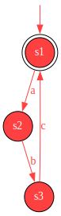
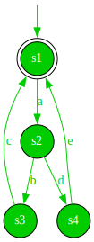
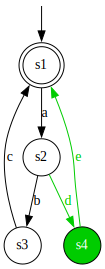

# Example: comparing two difference automata

In this example, we create two simple difference automata, and compare and merge them.
Difference automata are automata with difference information.
The difference information encodes whether something was removed (displayed in red), added (displayed in green), or remained the same (displayed in black).
In this case, we create two difference automata, one entirely red, and the other entirely green.
We then compare and merge them.
In the merge result, the common parts of the structures of the inputs are marked as unchanged (displayed in black), while their differences will remain (displayed in red and green).

First, we create the two difference automata to compare, which are the inputs to gLTSdiff.
A difference automaton is represented by the `DiffAutomaton` class.
It is parameterized with the type of the transition labels.
Here, we use simple `String`s as labels.

The following Java code creates the first difference automaton:

```java
// Create the first input automaton to compare.
DiffAutomaton<String> first = new DiffAutomaton<>();
State<DiffAutomatonStateProperty> f1 = first.addState(
    new DiffAutomatonStateProperty(true, DiffKind.REMOVED, Optional.of(DiffKind.REMOVED)));
State<DiffAutomatonStateProperty> f2 = first.addState(
    new DiffAutomatonStateProperty(false, DiffKind.REMOVED, Optional.empty()));
State<DiffAutomatonStateProperty> f3 = first.addState(
    new DiffAutomatonStateProperty(false, DiffKind.REMOVED, Optional.empty()));
first.addTransition(f1, new DiffProperty<>("a", DiffKind.REMOVED), f2);
first.addTransition(f2, new DiffProperty<>("b", DiffKind.REMOVED), f3);
first.addTransition(f3, new DiffProperty<>("c", DiffKind.REMOVED), f1);
```

This difference automaton looks like this:



We similarly create the second difference automaton:

```java
// Create the second input automaton to compare.
DiffAutomaton<String> second = new DiffAutomaton<>();
State<DiffAutomatonStateProperty> s1 = second.addState(
    new DiffAutomatonStateProperty(true, DiffKind.ADDED, Optional.of(DiffKind.ADDED)));
State<DiffAutomatonStateProperty> s2 = second.addState(
    new DiffAutomatonStateProperty(false, DiffKind.ADDED, Optional.empty()));
State<DiffAutomatonStateProperty> s3 = second.addState(
    new DiffAutomatonStateProperty(false, DiffKind.ADDED, Optional.empty()));
State<DiffAutomatonStateProperty> s4 = second.addState(
    new DiffAutomatonStateProperty(false, DiffKind.ADDED, Optional.empty()));
second.addTransition(s1, new DiffProperty<>("a", DiffKind.ADDED), s2);
second.addTransition(s2, new DiffProperty<>("b", DiffKind.ADDED), s3);
second.addTransition(s3, new DiffProperty<>("c", DiffKind.ADDED), s1);
second.addTransition(s2, new DiffProperty<>("d", DiffKind.ADDED), s4);
second.addTransition(s4, new DiffProperty<>("e", DiffKind.ADDED), s1);
```

It looks like this:



Next, we configure gLTSdiff to compare, merge, and write difference automata with `String`-typed labels.
While we can directly use the `StructureComparator` class, it is typically easier to use a builder.
Builders hide many low-level details and provide default configuration, allowing to perform comparisons using less code.
We configure gLTSdiff using the builder that is tailored specifically for comparison of difference automata, as follows:

```java
// Configure comparison, merging and writing.
DiffAutomatonStructureComparatorBuilder<String> builder =
    new DiffAutomatonStructureComparatorBuilder<>();
var comparator = builder.createComparator();
var writer = builder.createWriter();
```

We then use the `comparator` to perform the comparison and merging:

```java
// Apply structural comparison to the two input automata.
DiffAutomaton<String> result = comparator.compare(first, second);
```

Finally, write to the resulting merged difference automaton to a DOT file (`result.dot`) using the `writer`.
And we render the DOT file to an SVG image (`result.svg`) using the `DotRenderer` utility class:

```java
// Write the result to a file in DOT format, and render it to SVG.
Path resultDotPath = Paths.get("result.dot");
writer.write(result, resultDotPath);
Path resultSvgPath = DotRenderer.renderDot(resultDotPath);
```

The resulting `result.svg` then looks like this:



The code for this example is also available in the gLTSdiff [source code](../src/main/java/com/github/tno/gltsdiff/examples/SimpleDiffExample.java).
