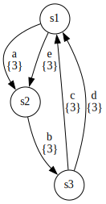

# Example: merging three version-annotated automata

In this example, we create three version-annotated automata, and compare and merge them.
Version-annotated automata are automata with additional version numbers on the transitions.
In this case, we create three such automata, the first annotated with version 1, the second annotated with version 2, and the third annotated with version 3.
We then compare and merge them.
In the merge result, common transitions are annotated with all three versions, while transitions that are only present in some of the input models are annotated with only a subset of the versions.

## Inputs

First, we create the three automata to compare, which are the inputs to gLTSdiff.
A version-annotated automaton can be represented by the `Automaton` class.
It is parameterized with the type of the transition labels.
Here, we use a `Pair`, consisting of a `String`-typed label and a `Set` of `Integer`s representing the version numbers.

The following Java code creates the first version-annotated automaton:

```java
// Create the first input automaton to compare.
Automaton<Pair<String, Set<Integer>>> first = new Automaton<>();
State<AutomatonStateProperty> f1 = first.addState(new AutomatonStateProperty(false, false));
State<AutomatonStateProperty> f2 = first.addState(new AutomatonStateProperty(false, false));
State<AutomatonStateProperty> f3 = first.addState(new AutomatonStateProperty(false, false));
first.addTransition(f1, Pair.create("a", ImmutableSet.of(1)), f2);
first.addTransition(f2, Pair.create("b", ImmutableSet.of(1)), f3);
first.addTransition(f3, Pair.create("c", ImmutableSet.of(1)), f1);
```

This automaton looks like this:


We similarly create the second version-annotated automaton:

```java
// Create the second input automaton to compare.
Automaton<Pair<String, Set<Integer>>> second = new Automaton<>();
State<AutomatonStateProperty> s1 = second.addState(new AutomatonStateProperty(false, false));
State<AutomatonStateProperty> s2 = second.addState(new AutomatonStateProperty(false, false));
State<AutomatonStateProperty> s3 = second.addState(new AutomatonStateProperty(false, false));
second.addTransition(s1, Pair.create("a", ImmutableSet.of(2)), s2);
second.addTransition(s2, Pair.create("b", ImmutableSet.of(2)), s3);
second.addTransition(s3, Pair.create("c", ImmutableSet.of(2)), s1);
second.addTransition(s3, Pair.create("d", ImmutableSet.of(2)), s1);
```

It looks like this:


And we create the third version-annotated automaton:

```java
// Create the third input automaton to compare.
Automaton<Pair<String, Set<Integer>>> third = new Automaton<>();
State<AutomatonStateProperty> t1 = third.addState(new AutomatonStateProperty(false, false));
State<AutomatonStateProperty> t2 = third.addState(new AutomatonStateProperty(false, false));
State<AutomatonStateProperty> t3 = third.addState(new AutomatonStateProperty(false, false));
third.addTransition(t1, Pair.create("a", ImmutableSet.of(3)), t2);
third.addTransition(t2, Pair.create("b", ImmutableSet.of(3)), t3);
third.addTransition(t3, Pair.create("c", ImmutableSet.of(3)), t1);
third.addTransition(t3, Pair.create("d", ImmutableSet.of(3)), t1);
third.addTransition(t1, Pair.create("e", ImmutableSet.of(3)), t2);
```

It looks like this:



Next, we configure gLTSdiff to compare, merge, and write version-annotated automata.
While we can directly use the `StructureComparator` class, it is typically easier to use a builder.
Builders hide many low-level details and provide default configuration, allowing to perform comparisons using less code.
We configure gLTSdiff using the builder that is tailored specifically for comparison of automata, as follows:

## Configuration

```java
// Configure comparison, merging and writing.
AutomatonStructureComparatorBuilder<Pair<String, Set<Integer>>> builder =
    new AutomatonStructureComparatorBuilder<>();
builder.setTransitionPropertyCombiner(
    new PairCombiner<>(
        new EqualityCombiner<>(), new SetCombiner<>(new EqualityCombiner<>())));
builder.setTransitionPropertyHtmlPrinter(
    new PairHtmlPrinter<>("", new StringHtmlPrinter<>(), "<br/>",
        new SetHtmlPrinter<>(new StringHtmlPrinter<>(), "{", ",", "}"), ""));
var comparator = builder.createComparator();
var writer = builder.createWriter();
```

We create an `AutomatonStructureComparatorBuilder`.
It is parameterized with the type of the transition properties, in this case `Pair<String, Set<Integer>>`, indicating our pairs of labels and version sets.

We then configure how such transition properties can be compared and merged, by invoking `setTransitionPropertyCombiner`.
gLTSdiff relies on `Combiner`s for this, which are used the comparison and merging algorithms.
We use a `PairCombiner` for the `Pair` type.
The `PairCombiner` has two arguments, one for each of the elements of the `Pair`s.
For the `String`-typed labels, we use a simple `EqualityCombiner`.
It considers labels the same if they are equal, and merges them by picking one of the labels.
For the version sets of type `Set<Integer>`, we use a `SetCombiner`.
The `SetCombiner` requires a combiner for the elements of the set, which in our case are of type `Integer`.
We use an `EqualityCombiner` for the `Integer`s as well, to ensure that equal versions are considered the same, while unequal versions are considered to be different.
In this way, we configured how gLTSdiff should handle our transition properties, by instantiating combiners to match the structure of the `Pair<String, Set<Integer>>` type.

We also configure how such transition properties can be written to HTML, by invoking the `setTransitionPropertyHtmlPrinter` method.
Similar to configuring the transition property combiner, we configure the transition property printer over the structure of the `Pair<String, Set<Integer>>` type.
For the `Pair`s, we use a `PairHtmlPrinter`, that allows us to configure a prefix, infix and suffix, as well as printers for each of the elements of the pair.
We opt to print the label and set on different lines using a newline as infix (`<br/>` in XHTML syntax).
For the `String`-typed labels, we use a `StringHtmlPrinter` that uses the `String` directly, but does perform HTML escaping if needed.
For the set of versions we use a `SetHtmlPrinter`.
It allows us to configure the printer to use for the elements of the set, as well as a prefix, separator for between the elements, and a suffix.
We opt to print version sets as `{1,2}` by using `{` as a prefix, `}` as a suffix, and `,` as separator.
For the version numbers of type `Integer`, we use a `StringHtmlPrinter`, which converts an `Integer` to a `String`.

## Comparison

We then use the `comparator` to perform the comparison and merging:

```java
// Apply structural comparison to the three input automata.
var inputs = List.of(first, second, third);
Automaton<Pair<String, Set<Integer>>> result = comparator.compare(inputs);
```

This first performs a comparison of the first two automata, and merges them.
It then compares the result to the third automaton, and merges them as well.
The final result is thus the result of merging all three input automata.

## View the result

Finally, we write the resulting merged version-annotated automaton to a DOT file (`result.dot`) using the `writer`.
And we render the DOT file to an SVG image (`result.svg`) using the `DotRenderer` utility class.
Note that the latter requires [GraphViz](dependency-graphviz.md).

```java
// Write the result to a file in DOT format, and render it to SVG.
Path resultDotPath = Paths.get("result.dot");
writer.write(result, resultDotPath);
Path resultSvgPath = DotRenderer.renderDot(resultDotPath);
```

The resulting `result.svg` then looks like this:


You can for instance see that the `e` transition is only present in version 3 of the model, while the `a` transition is present in all three versions.

The code for this example is also available in the gLTSdiff [source code](../src/main/java/com/github/tno/gltsdiff/examples/MoreThanTwoInputsExample.java).
