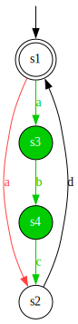
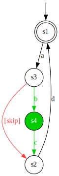

# Example: post-processing difference automata

In this example, we create two simple difference automata, compare and merge them, and show how post-processing can improve the result.
It is recommended to first look at the basic [difference automata comparison example](example-compare-two-diff-automata.md).
In this case, we compare and merge the difference automata both with and without post-processing, to show how post-processing improves the result.

## Inputs

First, we create the two difference automata to compare, which are the inputs to gLTSdiff:

```java
// Create the first input automaton to compare.
DiffAutomaton<String> first = new DiffAutomaton<>();
State<DiffAutomatonStateProperty> f1 = first.addState(
    new DiffAutomatonStateProperty(true, DiffKind.REMOVED, Optional.of(DiffKind.REMOVED)));
State<DiffAutomatonStateProperty> f2 = first.addState(
    new DiffAutomatonStateProperty(false, DiffKind.REMOVED, Optional.empty()));
first.addTransition(f1, new DiffProperty<>("a", DiffKind.REMOVED), f2);
first.addTransition(f2, new DiffProperty<>("d", DiffKind.REMOVED), f1);

// Create the second input automaton to compare.
DiffAutomaton<String> second = new DiffAutomaton<>();
State<DiffAutomatonStateProperty> s1 = second.addState(
    new DiffAutomatonStateProperty(true, DiffKind.ADDED, Optional.of(DiffKind.ADDED)));
State<DiffAutomatonStateProperty> s2 = second.addState(
    new DiffAutomatonStateProperty(false, DiffKind.ADDED, Optional.empty()));
State<DiffAutomatonStateProperty> s3 = second.addState(
    new DiffAutomatonStateProperty(false, DiffKind.ADDED, Optional.empty()));
State<DiffAutomatonStateProperty> s4 = second.addState(
    new DiffAutomatonStateProperty(false, DiffKind.ADDED, Optional.empty()));
second.addTransition(s1, new DiffProperty<>("a", DiffKind.ADDED), s2);
second.addTransition(s2, new DiffProperty<>("b", DiffKind.ADDED), s3);
second.addTransition(s3, new DiffProperty<>("c", DiffKind.ADDED), s4);
second.addTransition(s4, new DiffProperty<>("d", DiffKind.ADDED), s1);
```

This input automata look like this:


## Configuration

Next, we configure gLTSdiff to compare, merge, and write difference automata for `String`-typed labels, without performing post-processing.
We configure gLTSdiff using the builder that is tailored specifically for comparison of difference automata, as follows:

```java
// Configure comparison, merging and writing, without rewriters for post-processing.
DiffAutomatonStructureComparatorBuilder<String> builder =
    new DiffAutomatonStructureComparatorBuilder<>();
builder.setRewriters(Collections.emptyList());
var comparator = builder.createComparator();
var writer = builder.createWriter();
```

We create a builder, comparator and writer as in the basic example.
Since post-processing is performed by default, we explicitly disable it by setting an empty collection of rewriters, using the `setRewriters` method.

## Comparison

We then use the `comparator` to perform the comparison and merging:

```java
// Apply structural comparison to the two input automata.
DiffAutomaton<String> result = comparator.compare(first, second);
```

## View the non-post-processed result

Then, we write the resulting merged difference automaton to a DOT file (`result1.dot`) using the `writer`.
And we render the DOT file to an SVG image (`result1.svg`) using the `DotRenderer` utility class.
Note that the latter requires [GraphViz](dependency-graphviz.md).

```java
// Write the result to a file in DOT format, and render it to SVG.
Path resultDotPath = Paths.get("result1.dot");
writer.write(result, resultDotPath);
Path resultSvgPath = DotRenderer.renderDot(resultDotPath);
```

The resulting `result1.svg` then looks like this:



You may observe that the result is not as simple as it could be.
From the `s1` state, there are both red and green outgoing transitions labeled with `a`.
It would be better if these were merged together to a single black `a` transition, as this does not indicate an actual difference between the two input automata.
This is exactly what post-processing can do for us.

## Reconfiguration

We reconfigure gLTSdiff to compare, merge, and write difference automata for `String`-typed labels, but this time with performing post-processing:

```java
// Reconfigure comparison, merging and writing, with rewriters for post-processing.
builder.addDefaultRewriters();
builder.setDiffAutomatonTransitionPropertyHider(new SubstitutionHider<>("[skip]"));
comparator = builder.createComparator();
writer = builder.createWriter();
```

We use the same builder as before.
We re-add the default rewriters, undoing the change we made earlier.
Furthermore, we also configure a hider for the difference automaton transition properties.
Hiders are used by some of the rewriters that perform the post-processing.
We tell gLTSdiff to hide our `String`-typed labels by replacing such labels by a fixed text, `[skip]`.
And then we obtain a new `comparator` and `writer`.

## Recomparison

We then perform comparison and merging once more:

```java
// Apply structural comparison to the two input automata.
DiffAutomaton<String> result = comparator.compare(first, second);
```

## View the post-processed result

Then, we write the new resulting merged difference automaton to a DOT file (`result2.dot`) using the `writer`.
And we render the DOT file to an SVG image (`result2.svg`) using the `DotRenderer` utility class.
Again, the latter requires [GraphViz](dependency-graphviz.md).

```java
// Write the result to a file in DOT format, and render it to SVG.
Path resultDotPath = Paths.get("result2.dot");
writer.write(result, resultDotPath);
Path resultSvgPath = DotRenderer.renderDot(resultDotPath);
```

The resulting `result2.svg` then looks like this:



You may observe that there is now a single black transition labeled with `a`.
The difference automaton now more clearly shows that the second/green input allows additional `b` and `c` actions, while they are skipped in the first/red input.

The code for this example is also available in the gLTSdiff [source code](../src/main/java/com/github/tno/gltsdiff/examples/PostProcessingExample.java).
